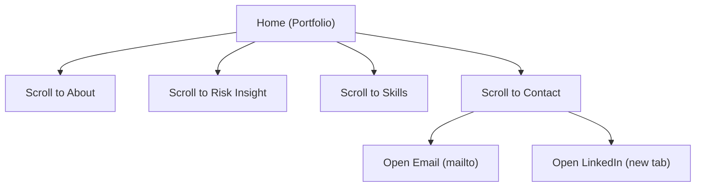

## 1. Product Overview
Website portofolio personal Enggar (berbahasa Inggris) untuk menampilkan profil SRE ex-DBA, proyek unggulan “Risk Insight”, skills, dan kanal kontak. Dibuat responsif (desktop-first) dengan animasi/motion halus untuk meningkatkan kesan profesional.

## 2. Core Features

### 2.1 Feature Module
Kebutuhan website portofolio ini terdiri dari halaman utama berikut:
1. **Home (Portfolio)**: navigasi anchor, hero profil, ringkasan “About”, highlight proyek Risk Insight, daftar skills, dan section kontak (email/LinkedIn).

### 2.2 Page Details
| Page Name | Module Name | Feature description |
|---|---|---|
| Home (Portfolio) | Header + Navigation | Menampilkan nama/brand “Enggar” dan menu anchor ke About, Project, Skills, Contact; menyediakan CTA “Contact”. |
| Home (Portfolio) | Hero / Intro | Menampilkan headline dalam bahasa Inggris (mis. “Site Reliability Engineer (ex-DBA)”) + ringkasan 1–2 kalimat + tombol “View Project” dan “Contact”. |
| Home (Portfolio) | About (SRE ex-DBA) | Menjelaskan profil singkat SRE dengan latar ex-DBA; menonjolkan fokus: reliability, performance, incident response, observability. |
| Home (Portfolio) | Featured Project: Risk Insight | Menampilkan kartu proyek “Risk Insight” dengan ringkasan, peran, problem→approach→impact; menyediakan tautan (jika ada) atau tombol “Read summary” (expand/collapse modal/accordion). |
| Home (Portfolio) | Skills | Menampilkan daftar skill terstruktur (kategori: SRE/Infra, Database, Observability, Automation, Cloud/Containers) dalam bentuk chip/list. |
| Home (Portfolio) | Contact | Menampilkan tombol/tautan mailto ke email + tautan LinkedIn; menampilkan teks ajakan singkat. |
| Home (Portfolio) | Motion & Accessibility | Mengaktifkan animasi halus untuk section reveal/hover; menghormati prefers-reduced-motion; menjaga kontras dan fokus keyboard untuk link/CTA. |

## 3. Core Process
**Visitor Flow (tanpa login):**
1. Kamu membuka Home dan melihat headline + CTA utama.
2. Kamu memilih menu (About/Project/Skills/Contact) untuk scroll ke section terkait.
3. Kamu membuka ringkasan proyek Risk Insight (expand/modal) untuk melihat detail singkat.
4. Kamu menekan “Email” untuk membuka aplikasi email (mailto) atau menekan “LinkedIn” untuk membuka profil LinkedIn di tab baru.

