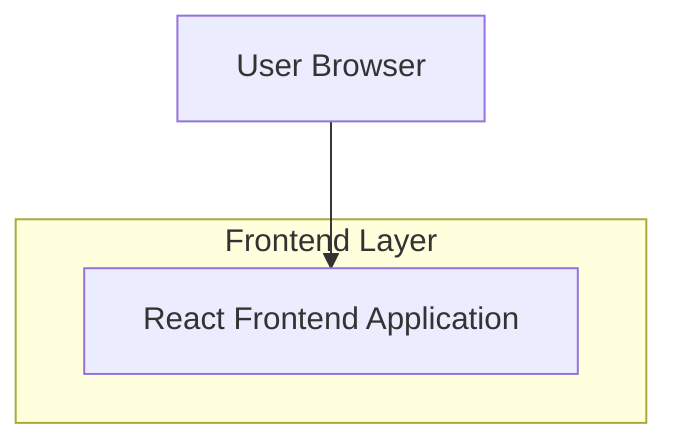

## 1.Architecture design

## 2.Technology Description
- Frontend: React@18 + vite + TypeScript + tailwindcss@3
- Motion/Animation: framer-motion (atau CSS transitions bila sederhana)
- Backend: None

## 3.Route definitions
| Route | Purpose |
|---|---|
| / | Single-page portfolio (anchor navigation: About, Project, Skills, Contact) |
